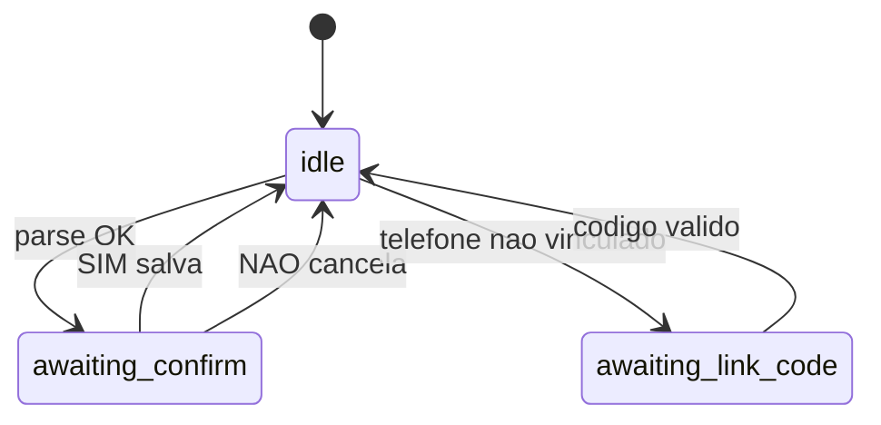

# WhatsApp — Evolution API + Orquestrador

Integração para lançar despesas/receitas via WhatsApp com confirmação em duas etapas (sem LLM na confirmação).

## Pré-requisitos

1. Migration [`004-whatsapp-sessions.sql`](migrations/004-whatsapp-sessions.sql) aplicada no Supabase
2. Variáveis no **Vercel** (Settings → Environment Variables):

| Variável | Exemplo |
|----------|---------|
| `OPENAI_API_KEY` | `sk-...` |
| `OPENAI_MODEL` | `gpt-4o-mini` (opcional) |
| `WHISPER_MODEL` | `whisper-1` (opcional) |
| `EVOLUTION_API_URL` | `https://seu-servidor:8080` |
| `EVOLUTION_API_KEY` | mesma chave do Docker |
| `EVOLUTION_INSTANCE_NAME` | `smart-finances` |
| `WHATSAPP_WEBHOOK_SECRET` | string longa aleatória |
| `SUPABASE_SERVICE_ROLE_KEY` | já existente |

## 1. Subir Evolution API (Docker)

```bash
cd docker/evolution-api
cp .env.example .env
# Edite .env com WHATSAPP_WEBHOOK_URL e EVOLUTION_API_KEY
docker compose up -d
```

Crie a instância e conecte o QR Code:

```bash
curl -X POST "http://localhost:8080/instance/create" \
  -H "apikey: SUA_CHAVE" \
  -H "Content-Type: application/json" \
  -d '{"instanceName":"smart-finances","integration":"WHATSAPP-BAILEYS","qrcode":true}'
```

Obtenha o QR:

```bash
curl "http://localhost:8080/instance/connect/smart-finances" -H "apikey: SUA_CHAVE"
```

Configure o webhook global (se não usar variáveis do compose):

```bash
curl -X POST "http://localhost:8080/webhook/set/smart-finances" \
  -H "apikey: SUA_CHAVE" \
  -H "Content-Type: application/json" \
  -d '{
    "webhook": {
      "enabled": true,
      "url": "https://smart-finances-psi.vercel.app/api/whatsapp/webhook",
      "webhookByEvents": false,
      "events": ["MESSAGES_UPSERT"]
    }
  }'
```

Envie o header `x-webhook-secret` igual a `WHATSAPP_WEBHOOK_SECRET` na Evolution (ou use `?secret=` na URL do webhook).

## 2. Vincular conta no app

1. Faça login como **admin**
2. Abra **Configurações → WhatsApp**
3. Clique **Gerar código** (válido 30 min)
4. Do celular vinculado ao WhatsApp da instância, envie o código de 6 dígitos
5. Pronto — envie lançamentos em texto ou áudio

## 3. Fluxo conversacional (orquestrador)



Comandos **sem LLM**: `sim`, `não`, `cancelar`, `saldo`, `ajuda`.

Parse: regex PT-BR primeiro → OpenAI `gpt-4o-mini` se necessário.

Áudio: Whisper → texto → mesmo fluxo.

## 4. Endpoints

| Método | Rota | Auth |
|--------|------|------|
| POST | `/api/whatsapp/webhook` | `WHATSAPP_WEBHOOK_SECRET` |
| GET | `/api/whatsapp/link` | Bearer Supabase |
| POST | `/api/whatsapp/link` | Bearer (admin) — gera código |
| DELETE | `/api/whatsapp/link` | Bearer (admin) — desvincula |

## 5. Alternativa: Twilio / Meta Cloud API

Para produção com número oficial, substitua apenas a camada Evolution:

- Webhook recebe payload Meta/Twilio
- Normaliza para `{ phoneRaw, text, audioUrl }`
- Reutiliza `whatsapp-orchestrator.js` sem alterações

## Troubleshooting

- **Código inválido**: gere novo código; expira em 30 min
- **Webhook 401**: confira `WHATSAPP_WEBHOOK_SECRET`
- **Sem resposta**: Evolution precisa alcançar URL pública HTTPS do Vercel
- **Áudio falha**: confira `OPENAI_API_KEY` e URL do áudio acessível pelo servidor
